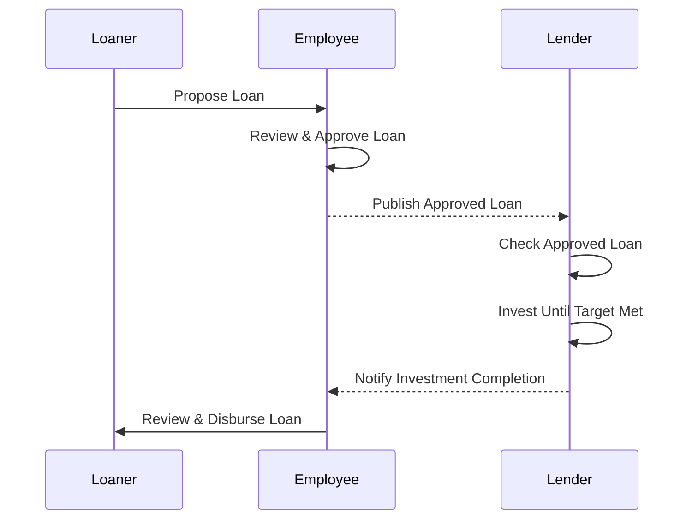
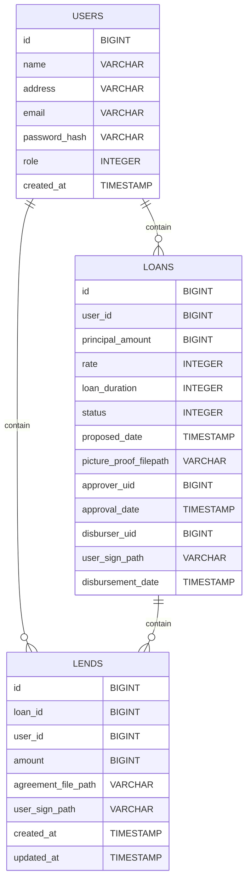

# Amartha Loan Service Solution

Backend service implementing loan management with four-phase lifecycle: propose, approve, invest, and disburse.

# High Level Diagram


# ERD


## Features
  - User Management
    - Generate User
    - Get All User
  - Loaner
    - Simulate Loan
    - Get Own Loan
    - Propose Loan
    - Get Proof Picture of Approved Loan
    - Get List Lender of Approved Loan
    - Get Agreement Letter
  - Lender
    - Get List Approved Loan
    - Get List Invested Loan
    - Simulate Lend
    - Invest
    - Get Agreement Letter
  - Employee
    - Approve Loan
    - Disburse Loan
   
## Note!!!
There're 2 user role: Customer (Loaner & Lender) and Employee.

```bash
Customer Role -> 1
Employee Role -> 2
```


For some APIs need Basic Auth to make sure the users have the access of their data
```bash
username -> user_email 
password -> user_pass
```

Here's the APIs:
  - Customer
    - Get Own Loan
    - Propose Loan
    - Get Proof Picture of Approved Loan (Employee can access)
    - Get List Lender of Approved Loan
    - Get Agreement Letter
    - Get List Approved Loan
    - Get List Invested Loan
    - Simulate Lend
    - Invest
  - Employee
    - Approve Loan
    - Disburse Loan

## Prerequisites
- Go (>= 1.20)

## Installation & Execution

### 1. Clone repository
```bash
  git clone git@github.com:GregChrisnaDev/Amartha-Sol-3.git
```

### 2. Start Docker containers
```bash
  docker compose up
```

### 3. Install migration tool
```bash
  make tool-migrate
```

### 4. Setup env file
```bash
.env
```

### 5. Run database migrations
```bash
make migrate
```

### 6. Install dependencies
```bash
go mod tidy
go mod vendor
```

### 7. Start application
```bash
make run
```

